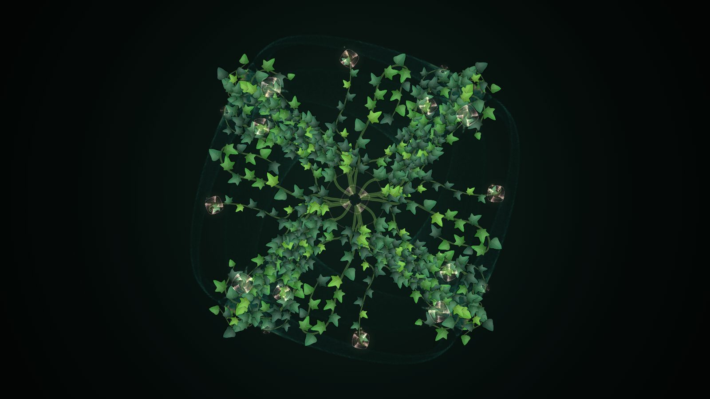

# Design-Portfolio-1

York-14 のデザイン・ジェネラティブアート作品集です。

## Beauty Between Order and Chaos

**Beauty Between Order and Chaos**（別名 Ivy Mandala）は、York-14 が 2026 年に制作した、ブラウザで動くジェネラティブアート作品です。Field & Golubitsky の対称カオス写像（symmetric icons）が描くアトラクタに沿って蔦と葉が伸び、秩序（Order）と混沌（Chaos）が 80〜120 BPM のテンポで繰り返します。外部ライブラリを使わない HTML 1 ファイル（Canvas 2D・Web Audio API）で動きます。

> **English summary:** *Beauty Between Order and Chaos* (also known as *Ivy Mandala*) is a browser-based generative artwork by York-14 (2026). Ivy vines and leaves grow along the attractor of the Field–Golubitsky symmetric chaos map, and the piece cycles between order and chaos at a tempo that drifts between 80 and 120 BPM. The equation stays fixed while its parameters change for every flower, chosen by an aesthetic score, Beauty = Order × Complexity × Contrast. It runs as a single dependency-free HTML file using Canvas 2D and the Web Audio API.

- 🌐 デモ / Demo: https://york-14.github.io/Design-Portfolio-1/ivy-order-chaos/
- 📄 ソース / Source: [`ivy-order-chaos/index.html`](ivy-order-chaos/index.html)
- ⚖️ ライセンス / License: コードは PolyForm Noncommercial 1.0.0、作品画像は CC BY-NC 4.0、この README の文章は CC BY 4.0（[ライセンス](#ライセンス)の節を参照）




### 作品の概要

| 項目 | 内容 |
|---|---|
| 作品名 | Beauty Between Order and Chaos（別名 Ivy Mandala） |
| 作者 | York-14（https://github.com/York-14） |
| 制作年 | 2026 年（初公開 2026-10-04） |
| 種別 | ジェネラティブアート、インタラクティブ作品、ブラウザ作品 |
| 数理モデル | Field–Golubitsky 対称カオス写像、対称群 D<sub>n</sub> / C<sub>n</sub>、最大 Lyapunov 指数、Beauty = Order × Complexity × Contrast |
| 動き | 64 拍で 1 輪。萌芽 → 成長 → 開花（秩序）→ 混沌 → 還元。テンポは 80〜120 BPM |
| 操作 | タップで波紋、ドラッグで蔦が伸びる、WALK / CHAOS で花の選び方を切り替え、任意で拍同期のサウンド |
| 技術 | HTML 1 ファイル、Canvas 2D、Web Audio API、外部ライブラリなし |
| 元になった作品 | [Generative Flower — Order × Chaos](https://york-14.github.io/Generative-flower-Order-Chaos/)（York-14） |
| ライセンス | コード: PolyForm Noncommercial 1.0.0 / 画像: CC BY-NC 4.0 / README の文章: CC BY 4.0 |

### 数理モデルとビジュアルの対応

Beauty Between Order and Chaos は、次の対称カオス写像（Field & Golubitsky の symmetric icons）を毎フレーム反復して描きます。

プレーンテキスト表記: `z(t+1) = (λ + α|z|² + β·Re(zⁿ) + iω)·z + γ·conj(z)^(n−1)`（z は複素数、n は回転対称の次数）

$$
z_{t+1} = \left(\lambda + \alpha |z|^2 + \beta\,\mathrm{Re}(z^n) + i\omega\right) z + \gamma\,\bar{z}^{\,n-1}
$$

| モデル | ビジュアル |
|---|---|
| アトラクタの密度（log 圧縮 + ぼかし） | 蔦が辿る「地形」。蔦の先端は 3 本の触角で密度の尾根を探して伸びる（Jones (2010) の Physarum モデルと同じ型の走性） |
| 対称群 D<sub>n</sub>（ω = 0）/ C<sub>n</sub>（ω ≠ 0） | 基本領域で 1 本育てた蔦を n 回（鏡映ありなら 2n 回）複製。混み具合は群の軌道全体に書き込むので、蔦は自分の対称像も避ける |
| Beauty = O × C × K | 次に咲く花を選ぶ評価関数（Order × Complexity × Contrast）。候補の中から最大のものを選ぶ（「花の選び方」の節を参照） |
| 最大 Lyapunov 指数 | 混沌の位相で写像を変形させる先（混沌側のパラメータ）を選ぶ基準。発散せずに λ<sub>1</sub> が大きい近傍を探し、ω を 0 以外にして鏡映対称を壊す |
| 写像の軌道そのもの | 背景の塵（ライブ積分）、蔦の先に咲く花、曼荼羅中心のメダリオン。花はすべてその回の写像の縮図 |

### 1 サイクル（64 拍 ≒ 35〜45 秒）

Beauty Between Order and Chaos は、1 つの花（1 組のパラメータ）を 64 拍で育てて散らし、次の花へ移ります。

| 拍 | 位相 | 内容 |
|---|---|---|
| 0–6 | 萌芽 SPROUT | 中心から n 本（2n 本）の茎が放射。拍ごとに成長が脈打つ |
| 6–28 | 成長 GROWTH | 分枝・互生の葉・肥大成長。葉は easeOutBack で開く |
| 28–45 | 開花 BLOOM · ORDER | 巻きひげの先にアトラクタの花が開く。全ての複製が完全に重なる |
| 45–60 | 混沌 CHAOS | 写像を混沌側のパラメータへ連続変形。複製ごとに位相がずれ、葉は紅葉して風に散る |
| 60–76 | 還元 RETURN | 枯れて消えながら、次の花（別の写像・別のテーマ）が芽吹く |

### テンポ（80 ↔ 120 BPM）

Beauty Between Order and Chaos の動きの速さは、音楽のテンポ（BPM）で決まり、80〜120 BPM のあいだを行き来します。

```
tension = 0.06 + 0.64·chaos + 0.20·LFO(96 秒周期) + 0.50·energy
BPM     = 80 + 40·tension   （約 2 秒で滑らかに追従）
```

- 秩序の位相では 80 BPM 台で静かに呼吸し、混沌に入ると 110 BPM 前後まで加速する
- 観客がタップ・ドラッグすると `energy` が上がり 120 BPM まで駆け上がる。放っておくと戻る
- サイクルは「拍」で数えるので、テンポが上がると混沌の時間そのものが速く過ぎる

拍は成長の脈動、葉の鼓動、花の明滅、中心からの波紋（秩序では n 回対称の花形、混沌では歪む）に同期します。

### 操作

| 入力 | 動作 |
|---|---|
| タップ / クリック | 葉群を伝わる波紋。混沌が一時的に高まり、テンポが上がる |
| ドラッグ / マウス移動 | 蔦の先端が光（ポインタ）へ伸びる。対称群の全ての像へ同時に伸びるので秩序は保たれる |
| WALK / CHAOS ボタン（右上）・`M` キー | 花の選び方を切り替える。今の花は早めに混沌へ進み、次の花から新しいモードになる |
| `S` / SOUND ボタン | 拍同期のサウンド（撥弦・心拍・葉擦れ・パッド。秩序は五音音階、混沌は不協和） |
| `F` / ダブルクリック | フルスクリーン |
| `H` | HUD の表示切替 |
| `Space` | 混沌のバースト |

### 花の選び方（数式は固定、パラメータだけが変わる）

写像の式はずっと同じで、λ, α, β, γ, ω, n だけを輪ごとに変えます。ページを開くたびに違う花の連なりになります。選び方は 2 つあり、画面右上の WALK / CHAOS ボタン（または URL の `?mode=`）で切り替えます。

| モード | 次の花の決め方 | 見え方 |
|---|---|---|
| `?mode=walk` B. パラメータ空間の散歩 | 前の花のパラメータを正規分布で少しずらした近傍を最大 90 個試す。成立する（発散せず形になる）ものを 4 つ集め、Beauty が最大の一歩へ進む。ときどき n が ±1 したり、ω が 0 ⇄ 非 0 に切り替わって鏡映が壊れたり戻ったりする。袋小路では遠くへ跳ぶ（`WALK · LEAP`） | 花が系譜のように少しずつ変わっていく |
| `?mode=chaos`（既定）C. カオス由来 | 乱数関数（`Math.random`）を使わない。今咲いている花の写像を回し、軌道座標の下位桁を乱数源にして候補を引く。そこから Beauty 最大の花を選ぶ。次はその花の軌道が乱数源になる | 毎回大きく違う花。「混沌が次の秩序を生む」連鎖 |

どちらのモードでも、候補は元作品 Generative Flower の品質基準（`isGood`：ボックス次元・余白・Lyapunov 指数）でふるいにかけ、Beauty = O × C × K で選びます。

#### SEED

- `?seed=好きな文字列` を付けると、同じ SEED では同じパラメータの連なりが再現されます（例: `?mode=chaos&seed=moon`）
- 付けなければ毎回ランダムな SEED になります。今の SEED は HUD 左上に表示されるので、気に入った花はその SEED を URL に付けて呼び戻せます
- 再現されるのはパラメータの選び方です。蔦の分かれ方、葉の散り方、配色の順番などの細部は毎回変わります
- 浮動小数点の計算はブラウザによってごくわずかに異なることがあり、別のブラウザでは連なりが変わる場合があります

#### 起動

最初の花は裏で探します（実測 0.7〜2.5 秒）。見つかるまでは中心の種火だけが拍に合わせて灯り、画面は固まりません。15 秒たっても見つからない場合は、保険として Emperor's Cloak から始めます。

### URL パラメータ

| パラメータ | 内容 |
|---|---|
| `?mode=walk` / `?mode=chaos` | 起動時の花の選び方（「花の選び方」の節を参照）。既定は `chaos`。画面のボタンで切り替えると URL も更新される |
| `?seed=文字列` | 花の連なりを再現する |
| `?hud=0` | HUD なし（サイネージ用のクリーンな画面） |
| `?quality=low` | 低スペック端末向け（DPR 1、粒子・蔦の数を削減） |
| `?speed=4` | 時間倍率（プレビュー・確認用） |

例: https://york-14.github.io/Design-Portfolio-1/ivy-order-chaos/?hud=0 （サイネージ用）

### サイネージ運用

- 3.5 秒操作がないとカーソルと UI ボタンを隠す
- 平均フレーム時間が 26 ms を超えると解像度（DPR）を自動で下げる。描画面積の上限は約 8.5 M ピクセル
- 世代交代した庭は破棄し、粒子数にも上限があるので、長時間稼働してもメモリは一定
- 次の花の探索は 1 フレーム 4 ms の予算で裏で進める（最初の花だけ 12 ms）。間に合わないときは同じ花をもう一度咲かせる
- ブラウザの自動再生制限があるため、音はユーザー操作（S キー / ボタン）で開始する。iPhone では消音スイッチがオンでも鳴るよう、再生モードを切り替えている

### よくある質問

**Beauty Between Order and Chaos はどんな作品ですか？**
York-14 が 2026 年に制作した、ブラウザで動くジェネラティブアートです。対称カオス写像のアトラクタに沿って蔦と葉が伸び、秩序と混沌が 80〜120 BPM のテンポで繰り返します。

**蔦の形は何で決まりますか？**
Field & Golubitsky の対称カオス写像 `z(t+1) = (λ + α|z|² + β·Re(zⁿ) + iω)·z + γ·conj(z)^(n−1)` を反復してできるアトラクタの密度です。蔦はその密度の尾根をたどって伸び、対称群 D<sub>n</sub>（ω = 0 のとき）または C<sub>n</sub>（ω ≠ 0 のとき）で n 回（鏡映ありなら 2n 回）複製されます。

**毎回違う花になりますか？**
はい。数式は固定のまま、パラメータ λ, α, β, γ, ω, n だけが花ごとに変わります。CHAOS モード（既定）では、今咲いている花の軌道を乱数源にして次の花を選びます。WALK モードでは、前の花の近傍へ少しずつ進みます。

**同じ花をもう一度見られますか？**
URL に `?seed=好きな文字列` を付けると、同じ SEED では同じパラメータの連なりが再現されます。今の SEED は画面左上に表示されます。

**テンポ（BPM）は何で決まりますか？**
`BPM = 80 + 40 × tension` です。tension は混沌の度合い、96 秒周期のゆらぎ、見る人の操作（タップ・ドラッグ）から計算します。秩序の位相では 80 BPM 台、混沌の位相では 110 BPM 前後になります。

**動かすのに何が必要ですか？**
最新のブラウザだけです。外部ライブラリは使っていません。スマホでも動き、`?quality=low` で低スペック端末向けに軽くできます。

**商用で使えますか？**
York-14 の許可なく商用利用（店舗サイネージへの納品、展示、映像・印刷物への使用など）はできません。個人の鑑賞・学習・研究・非営利の利用は自由です。詳しくは[ライセンス](#ライセンス)の節を参照してください。

### 参考文献

- M. Field, M. Golubitsky. *Symmetry in Chaos: A Search for Pattern in Mathematics, Art and Nature*. Oxford University Press, 1992（第 2 版: SIAM, 2009）。対称カオス写像（symmetric icons）の出典。
- J. Jones. "Characteristics of Pattern Formation and Evolution in Approximations of *Physarum* Transport Networks." *Artificial Life* 16(2), 2010, pp. 127–153。蔦の先端が密度をたどる走性の考え方。
- York-14. [Generative Flower — Order × Chaos](https://york-14.github.io/Generative-flower-Order-Chaos/)。写像の実装、品質基準 `isGood`、Beauty = Order × Complexity × Contrast の出典。

### ライセンス

Copyright © 2026 York-14. 対象ごとに次のライセンスを適用します。

| 対象 | ライセンス | できること |
|---|---|---|
| ソースコード（`ivy-order-chaos/index.html` など） | [PolyForm Noncommercial 1.0.0](LICENSES/PolyForm-Noncommercial-1.0.0.md) | 非営利の目的での利用・改変・再配布 |
| 作品の画像・映像（`ivy-order-chaos/images/` と、作品を撮影・録画したもの） | [CC BY-NC 4.0](LICENSES/CC-BY-NC-4.0.txt) | クレジットを表示した非営利の利用・改変 |
| この README の文章 | [CC BY 4.0](LICENSES/CC-BY-4.0.txt) | クレジットを表示すれば、商用を含めて引用・転載・翻訳できる |

商用利用（店舗サイネージへの納品、展示、映像・印刷物への使用など）を希望する場合は、このリポジトリの Issue で York-14 にご連絡ください。全体の説明は [LICENSE.md](LICENSE.md) にあります。

### 引用するとき

次の形式で引用してください。GitHub の「Cite this repository」からも同じ情報（[CITATION.cff](CITATION.cff)）を取得できます。

> York-14. (2026). *Beauty Between Order and Chaos* [Generative artwork]. https://github.com/York-14/Design-Portfolio-1

### 更新履歴

- 2026-10-05: 表示のたびにパラメータを選び直す仕組み（CHAOS / WALK モード、SEED）、画面上のモード切り替え、スマホの音の修正、作品名を Beauty Between Order and Chaos に統一、ライセンスと引用情報を追加
- 2026-10-04: 初公開
